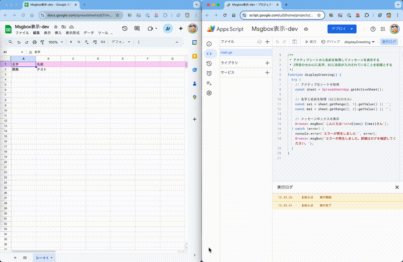

# spreadsheet-hello-message

スプレッドシート上の名前情報を取得し、挨拶メッセージを表示するシンプルなGoogle Apps Scriptアプリケーションです。

## 機能概要

このスクリプトは以下の機能を提供します：

- スプレッドシートのA2セル（名字）とB2セル（名前）から名前情報を取得
- 取得した名前を使用して挨拶メッセージをポップアップ表示
- エラー処理機能を含む安全な実装

## 前提条件

- Google アカウント
- Google スプレッドシートへのアクセス権
- [clasp](https://github.com/google/clasp)（ローカル開発環境の場合）

## 使用方法

### 1. スプレッドシートの準備

1. Google スプレッドシートを開く
2. A2セルに名字を入力
3. B2セルに名前を入力

例：
| A列 | B列 |
|-----|-----|
| 山田 | 太郎 |

### 2. スクリプトの実行

1. メニューから「拡張機能」→「Apps Script」を選択
2. スクリプトエディタが開いたら、`displayGreeting` 関数を実行
3. 必要に応じて権限を許可
4. 「こんにちは! 山田 太郎さん」というメッセージボックスが表示される

### 3. 動作デモ

以下は実際の動作デモです：



## 開発者向け情報

### ローカル開発環境のセットアップ

1. このプロジェクトをクローン
   ```bash
   cd sample-gas-clasp-local-develop/apps/spreadsheet-hello-message
   ```

2. Google にログイン
   ```bash
   clasp login
   ```

3. 開発環境の設定
   - 既存のScriptIDを利用する場合:
     ```bash
     # .clasp.json.sampleを.clasp.jsonにコピー
     cp .clasp.json.sample .clasp.json
     
     # .clasp.jsonを編集し、自分のScriptIDを設定
     vi .clasp.json
     # または次のコマンドで直接置換（YOUR_SCRIPT_ID_HEREを自分のScriptIDに置き換え）
     # macOSの場合:
     # 注意: 以下のコマンドはOSによって異なります。macOS、Linux、Windows (Git Bash) の例を示します。
     sed -i '' 's/YOUR_SCRIPT_ID_HERE/あなたのScriptID/g' .clasp.json
     sed -i '' 's/YOUR_SPREADSHEET_ID_HERE/あなたのSpreadsheetID/g' .clasp.json
     
     # Linuxの場合:
     sed -i 's/YOUR_SCRIPT_ID_HERE/あなたのScriptID/g' .clasp.json
     sed -i 's/YOUR_SPREADSHEET_ID_HERE/あなたのSpreadsheetID/g' .clasp.json
     
     # Windows (Git Bash)の場合:
     sed -i 's/YOUR_SCRIPT_ID_HERE/あなたのScriptID/g' .clasp.json
     sed -i 's/YOUR_SPREADSHEET_ID_HERE/あなたのSpreadsheetID/g' .clasp.json
     ```
     
   - 新しいScriptIDを作成する場合:
     ```bash
     clasp create --title "挨拶メッセージアプリ" --type sheets --rootDir .
     # 注意: このコマンドで.clasp.jsonが自動生成されます
     ```

### コードの修正とデプロイ

1. コードを修正
2. GASプロジェクトにアップロード
   ```bash
   # すでにapps/spreadsheet-hello-messageディレクトリにいる場合は以下のコマンドを実行
   clasp push
   ```

3. ブラウザでスクリプトエディタを開く
   ```bash
   clasp open
   ```

### 関数の説明

- `displayGreeting()`: メインの関数。スプレッドシートから名前情報を取得し、挨拶メッセージを表示します。

## トラブルシューティング

- **エラーメッセージが表示される場合**: A2、B2のセルに適切な値が入力されているか確認してください
- **権限エラーが発生する場合**: スクリプトを実行して表示される権限リクエストを承認してください
- **スクリプトが見つからない場合**: スプレッドシートに正しくスクリプトが紐付けられているか確認してください
